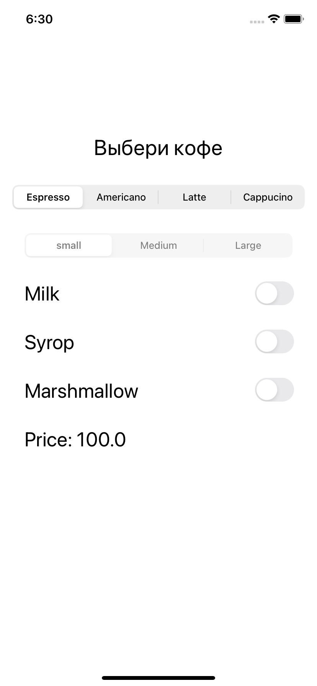
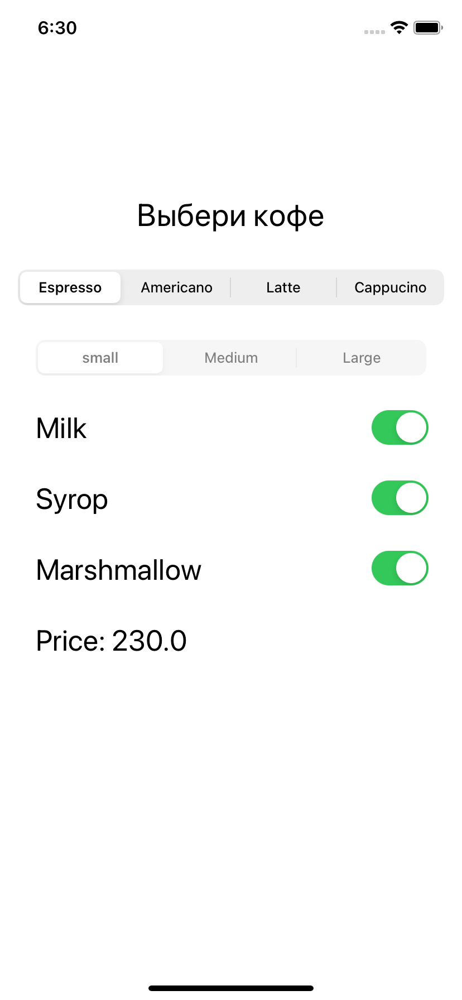
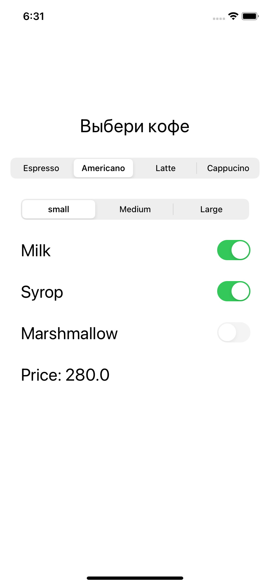
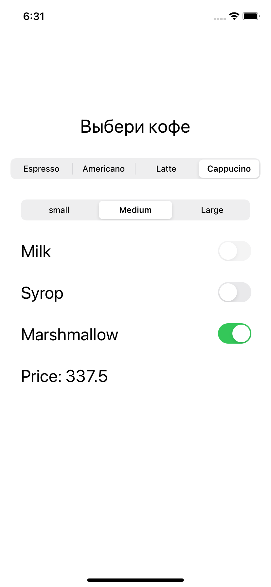
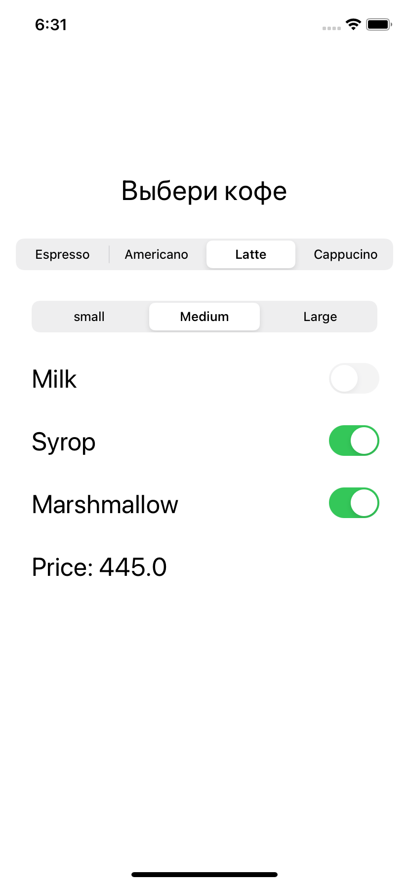

# CoffeeMaker

## Цель проекта
- изучаение паттернов проектирования
- применение паттернов на практике

## Какие паттерны были применены в проекте?
- Decorator.

## Функционал:
- Выбор напитка;
- Выбор объема напитка;
- Умное добавление топпингов;
- Расчёт итоговой стоимости напитка.

## Примеры экранов:

       
        

